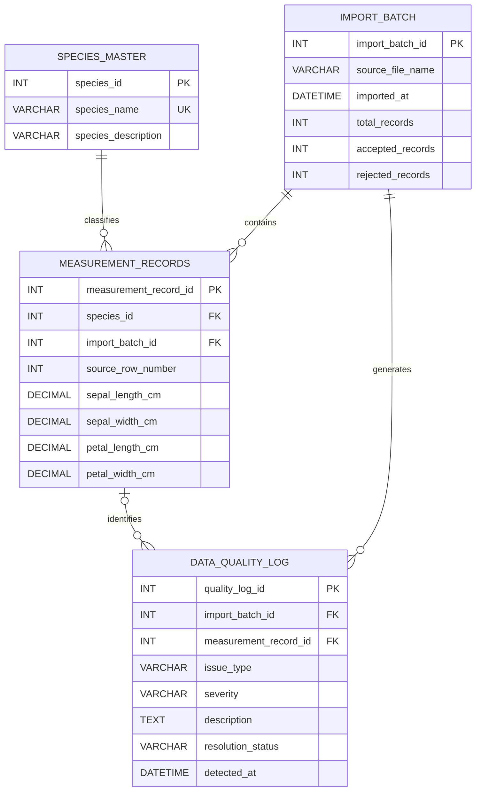

# IRIS SPECIES INVENTORY DATABASE
## Entity Relationship Diagram

```mermaid
erDiagram

    SPECIES_MASTER ||--o{ MEASUREMENT_RECORDS : classifies

    IMPORT_BATCH ||--o{ MEASUREMENT_RECORDS : contains

    IMPORT_BATCH ||--o{ DATA_QUALITY_LOG : generates

    MEASUREMENT_RECORDS o|--o{ DATA_QUALITY_LOG : identifies

    SPECIES_MASTER {
        INT species_id PK
        VARCHAR species_name UK
        VARCHAR species_description
    }

    IMPORT_BATCH {
        INT import_batch_id PK
        VARCHAR source_file_name
        DATETIME imported_at
        INT total_records
        INT accepted_records
        INT rejected_records
    }

    MEASUREMENT_RECORDS {
        INT measurement_record_id PK
        INT species_id FK
        INT import_batch_id FK
        INT source_row_number
        DECIMAL sepal_length_cm
        DECIMAL sepal_width_cm
        DECIMAL petal_length_cm
        DECIMAL petal_width_cm
    }

    DATA_QUALITY_LOG {
        INT quality_log_id PK
        INT import_batch_id FK
        INT measurement_record_id FK
        VARCHAR issue_type
        VARCHAR severity
        TEXT description
        VARCHAR resolution_status
        DATETIME detected_at
    }
```
